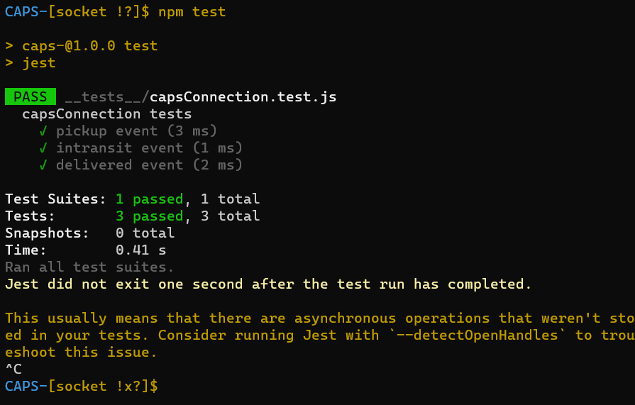
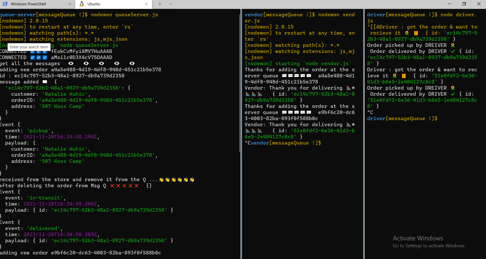

# CAPS-

### Event Driven Applications

## Author: Dima Alabsi

## Running the app

* node caps.js
* nodemon

* nodemon gueueServer.js

## Tests

* Unit Tests: **npm run test**

## Github actions

*    [actions](https://github.com/DimaAlabsi/CAPS-/actions)     

## pull request

* [lab 11 pull request](https://github.com/DimaAlabsi/CAPS-/pull/1)

* [lab 12 pull requset](https://github.com/DimaAlabsi/CAPS-/pull/2)

* [lab 13 pull requset](https://github.com/DimaAlabsi/CAPS-/pull/4)

# dependencies 💯

cors
dotenv
express
faker
jest
supertest
Socket.io
Socket.io-client
uuid

    

## UML

### lab 11

--------------------------------

### lab 12

---------------------

### lab 13 

